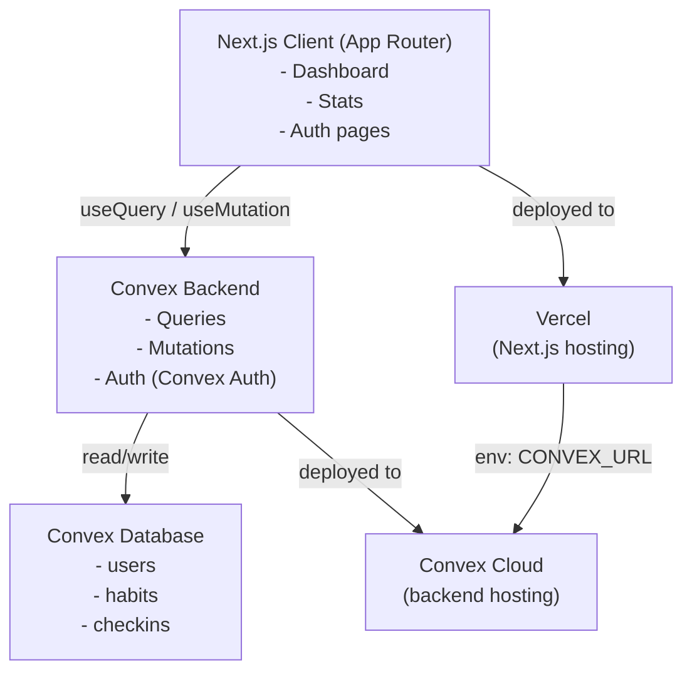

# PRD — Ritual

> Visual design tokens (colors, typography, spacing, components, motion) are defined in `docs/design.md`.
> That file does not yet exist. Run `/plaid design` with the streak.kevinchromik.de reference before any UI implementation begins.

---

## 1. Overview

### Product Summary

**Ritual** is a habit tracking web application that shows users the honest truth about their habits in under three seconds. It provides a single-dashboard view of all habits with current streak status and today's completion state. Users add habits, check them in daily, and review weekly/monthly statistics — nothing more.

The product is built for personal use first, with a clean enough architecture to open to the public without rework. The design philosophy is borrowed from monitoring infrastructure: fast, honest, zero overhead.

### Objective

This PRD covers the v1 MVP as defined in `docs/product-vision.md § Product Strategy — MVP Definition`. Scope: habit CRUD, daily check-ins, streak tracking, dashboard view, statistics view, email/password auth, and minimal onboarding.

### Market Differentiation

Ritual wins by being the fastest path from "app open" to "know my situation." No gamification, no gamified recovery mechanics, no streak-freeze. The technical implementation must deliver a dashboard that renders with data in under one second for returning users — this is the competitive moat.

### Magic Moment

A returning user opens Ritual in the morning. The dashboard renders immediately with all habits visible: emoji icon, habit name, current streak count, today's completion checkbox. The user can complete their full morning check-in in under ten seconds without leaving the dashboard. Convex's reactive queries enable this by pre-subscribing to habit data — the UI renders with data, not after a loading spinner.

### Success Criteria

- Time from app open to visible dashboard data: < 1s for returning users (Convex reactive query)
- Time from sign-up to first check-in: < 60 seconds
- All P0 functional requirements implemented and passing
- Mobile web (iOS Safari, Android Chrome) fully functional
- Dashboard renders correctly with 1 habit and with 20 habits

---

## 2. Technical Architecture

### Architecture Overview



### Chosen Stack

| Layer | Choice | Rationale |
|---|---|---|
| Frontend | Next.js (App Router) | Best ecosystem, excellent Convex integration, deploys to Vercel, great with Claude Code |
| Backend | Convex | Real-time reactive queries, no backend boilerplate, TypeScript end-to-end, Auth built-in |
| Database | Convex Database | Built-in to Convex, document-relational, automatic indexing, ACID transactions, reactive |
| Auth | Convex Auth | Native Convex integration, zero extra service, email/password in MVP |
| Payments | None | Free product — no payments needed |
| Styling | Tailwind CSS + shadcn/ui | Utility-first, shadcn provides accessible components, both work great with Next.js |
| Deployment | Vercel (Next.js) + Convex Cloud | Zero-config deployment for both layers |

### Stack Integration Guide

**Setup order:**
1. Initialize Next.js project with TypeScript and Tailwind
2. Add Convex: `npx convex dev` — this starts the Convex dev backend and generates type-safe client hooks
3. Configure Convex Auth in `convex/auth.ts`
4. Install shadcn/ui components as needed
5. Build features using Convex queries/mutations

**Key integration patterns:**
- Use `useQuery(api.habits.list)` in React components — data is reactive and updates in real time
- Use `useMutation(api.habits.create)` for writes — returns a promise that resolves after the mutation completes
- Convex Auth provides `useAuthActions()` for sign-in/sign-out and `useConvexAuth()` for auth state
- All Convex backend files live in `convex/` directory — TypeScript with full type inference to the client

**Environment variables required:**
```
CONVEX_DEPLOYMENT=<from `npx convex dev`>
NEXT_PUBLIC_CONVEX_URL=<from Convex dashboard>
```

**Common gotchas:**
- Convex uses its own `v` validator for schema definitions — not Zod, not Yup
- `ctx.auth.getUserIdentity()` in Convex functions returns null for unauthenticated requests — always guard
- Timezone: store all check-in timestamps as UTC. Streak calculation must happen in the user's local timezone — pass timezone from client
- Convex mutations are atomic — use them; don't try to chain multiple mutations from the client

### Repository Structure

```
habit-tracker/
├── src/
│   ├── app/                          # Next.js App Router
│   │   ├── layout.tsx                # Root layout with ConvexProvider + ConvexAuthNextjsServerProvider
│   │   ├── page.tsx                  # Redirect to /dashboard or /signin
│   │   ├── (auth)/
│   │   │   ├── signin/page.tsx       # Sign-in page
│   │   │   └── signup/page.tsx       # Sign-up page
│   │   ├── dashboard/
│   │   │   └── page.tsx             # Main dashboard — habit list + today's check-ins
│   │   └── stats/
│   │       └── page.tsx             # Statistics view
│   ├── components/
│   │   ├── ui/                       # shadcn/ui primitives (Button, Card, Input, etc.)
│   │   ├── habits/
│   │   │   ├── HabitCard.tsx         # Individual habit display + check-in
│   │   │   ├── HabitList.tsx         # Dashboard habit grid
│   │   │   ├── AddHabitModal.tsx     # Create/edit habit form
│   │   │   └── HabitEmoji picker.tsx # Emoji selection
│   │   ├── stats/
│   │   │   ├── ContributionGraph.tsx # GitHub-style streak calendar
│   │   │   ├── StatsCard.tsx         # Per-habit stats summary
│   │   │   └── CompletionRate.tsx    # Weekly/monthly rate display
│   │   └── layout/
│   │       ├── AppShell.tsx          # Authenticated layout wrapper
│   │       └── NavBar.tsx            # Top navigation
│   └── lib/
│       ├── utils.ts                  # cn() helper, date utils
│       ├── streaks.ts                # Streak calculation logic (client-side, timezone-aware)
│       └── constants.ts             # EMOJI_OPTIONS, CATEGORY_OPTIONS
├── convex/
│   ├── schema.ts                     # Database schema definitions
│   ├── auth.ts                       # Convex Auth configuration
│   ├── habits.ts                     # Habit CRUD queries + mutations
│   ├── checkins.ts                   # Check-in queries + mutations
│   ├── stats.ts                      # Aggregate stats queries
│   └── _generated/                   # Auto-generated by Convex (do not edit)
├── public/
│   └── favicon.ico
├── docs/
│   ├── product-vision.md
│   ├── prd.md
│   ├── product-roadmap.md
│   └── design.md                     # Generated by /plaid design (not yet created)
├── vision.json
├── .env.local                        # CONVEX_DEPLOYMENT, NEXT_PUBLIC_CONVEX_URL
├── convex.json                       # Convex project config
├── tailwind.config.ts
├── tsconfig.json
└── package.json
```

### Infrastructure & Deployment

**Development:** `npx convex dev` (starts Convex dev backend) + `npm run dev` (starts Next.js). Both must run simultaneously during development.

**Production:**
- Next.js → Vercel (connect GitHub repo, zero-config deploy)
- Convex → Convex Cloud (`npx convex deploy`)
- Set `CONVEX_DEPLOYMENT` and `NEXT_PUBLIC_CONVEX_URL` in Vercel environment variables

**CI/CD:** Vercel auto-deploys on push to `main`. Convex deploys separately via CLI or can be automated via `npx convex deploy` in a GitHub Action.

### Security Considerations

- Convex Auth handles session management. JWT tokens stored in httpOnly cookies by default.
- Every Convex query/mutation that touches user data must call `ctx.auth.getUserIdentity()` and return/throw if null.
- All database queries must filter by `userId` — never return data across users.
- Input validation: use Convex's `v` validators on all mutation arguments. No raw string insertion into queries (Convex handles this by design).
- No sensitive data stored: habits and check-ins contain no PII beyond the user's email (managed by Convex Auth).

### Cost Estimate

| Service | Free Tier | Estimated Cost (< 100 users) |
|---|---|---|
| Convex Cloud | 1M function calls/month, 1GB storage | $0 |
| Vercel | 100GB bandwidth, hobby projects | $0 |
| Total | | $0/month |

Scale estimate: Convex free tier supports ~1,000 daily active users with typical habit-tracking query patterns before hitting limits.

---

## 3. Data Model

### Entity Definitions

```typescript
// convex/schema.ts

import { defineSchema, defineTable } from "convex/server";
import { v } from "convex/values";

export default defineSchema({

  // users — created by Convex Auth, extended with profile data
  users: defineTable({
    name: v.optional(v.string()),        // Display name
    email: v.optional(v.string()),       // From auth provider
    timezone: v.optional(v.string()),    // IANA timezone string, e.g. "Europe/Berlin"
    createdAt: v.number(),               // Unix timestamp ms
  }).index("by_email", ["email"]),

  // habits — user-created recurring activities to track
  habits: defineTable({
    userId: v.id("users"),               // Owner
    name: v.string(),                    // "Running", "Reading", etc.
    emoji: v.string(),                   // Single emoji character: "🏃"
    category: v.optional(v.string()),    // "fitness", "learning", "mindfulness", etc.
    isActive: v.boolean(),               // false = archived, hidden from dashboard
    createdAt: v.number(),               // Unix timestamp ms
    sortOrder: v.optional(v.number()),   // For user-defined ordering
  })
    .index("by_user", ["userId"])
    .index("by_user_active", ["userId", "isActive"]),

  // checkins — one record per habit per day when marked complete
  checkins: defineTable({
    userId: v.id("users"),               // Owner (denormalized for query performance)
    habitId: v.id("habits"),             // Which habit
    date: v.string(),                    // ISO date string "YYYY-MM-DD" in user's local timezone
    completedAt: v.number(),             // Unix timestamp ms (UTC)
  })
    .index("by_habit", ["habitId"])
    .index("by_user_date", ["userId", "date"])
    .index("by_habit_date", ["habitId", "date"]),

});
```

### Relationships

- `habits.userId` → `users._id` (many habits per user)
- `checkins.habitId` → `habits._id` (many check-ins per habit)
- `checkins.userId` → `users._id` (denormalized — allows querying all user check-ins without habit join)

Delete cascade: When a habit is deleted, all associated check-ins should be deleted. Implement in the `habits.remove` mutation.

### Indexes

- `habits.by_user` — fetch all habits for a user (dashboard load)
- `habits.by_user_active` — fetch only active habits (filtered dashboard)
- `checkins.by_habit` — fetch all check-ins for a habit (stats view)
- `checkins.by_user_date` — fetch all check-ins for a user on a specific date (today's status)
- `checkins.by_habit_date` — check whether a habit has a check-in for a given date (streak calculation)

---

## 4. API Specification

### API Design Philosophy

Ritual uses Convex's TypeScript RPC model — not REST endpoints. Queries are for reads (reactive, cached), mutations are for writes (atomic, immediate). All functions are type-safe end-to-end.

Error handling: Convex mutations throw `ConvexError` with a message. Client code wraps `useMutation` calls in try/catch and shows toast notifications on failure.

### Habits API

```typescript
// convex/habits.ts

// List active habits for the authenticated user
query("habits.listActive", {
  args: {},
  returns: v.array(v.object({
    _id: v.id("habits"),
    name: v.string(),
    emoji: v.string(),
    category: v.optional(v.string()),
    sortOrder: v.optional(v.number()),
    createdAt: v.number(),
  })),
})

// Create a new habit
mutation("habits.create", {
  args: {
    name: v.string(),           // max 100 chars
    emoji: v.string(),          // single emoji
    category: v.optional(v.string()),
  },
  returns: v.id("habits"),
})

// Update habit name, emoji, or category
mutation("habits.update", {
  args: {
    habitId: v.id("habits"),
    name: v.optional(v.string()),
    emoji: v.optional(v.string()),
    category: v.optional(v.string()),
  },
  returns: v.null(),
})

// Soft-delete (archive) a habit — hides from dashboard, preserves history
mutation("habits.archive", {
  args: { habitId: v.id("habits") },
  returns: v.null(),
})

// Hard-delete a habit and all its check-ins
mutation("habits.remove", {
  args: { habitId: v.id("habits") },
  returns: v.null(),
})
```

### Check-ins API

```typescript
// convex/checkins.ts

// Get today's check-in status for all active habits
// Returns a Set-like structure for O(1) lookup on client
query("checkins.getTodayStatus", {
  args: {
    date: v.string(),           // "YYYY-MM-DD" in user's local timezone
  },
  returns: v.array(v.object({
    habitId: v.id("habits"),
    completed: v.boolean(),
    completedAt: v.optional(v.number()),
  })),
})

// Mark a habit as complete for a given date
mutation("checkins.complete", {
  args: {
    habitId: v.id("habits"),
    date: v.string(),           // "YYYY-MM-DD" in user's local timezone
  },
  returns: v.id("checkins"),
})

// Undo a check-in (remove completion for today only — not historical)
mutation("checkins.uncomplete", {
  args: {
    habitId: v.id("habits"),
    date: v.string(),           // must be today's date
  },
  returns: v.null(),
})

// Get check-ins for a habit over a date range (for stats)
query("checkins.getRange", {
  args: {
    habitId: v.id("habits"),
    startDate: v.string(),      // "YYYY-MM-DD"
    endDate: v.string(),        // "YYYY-MM-DD"
  },
  returns: v.array(v.object({
    date: v.string(),
    completedAt: v.number(),
  })),
})
```

### Stats API

```typescript
// convex/stats.ts

// Aggregate stats for all active habits (used for stats page)
query("stats.getAll", {
  args: {
    timezone: v.string(),       // IANA timezone
    today: v.string(),          // "YYYY-MM-DD" in user's local timezone
  },
  returns: v.array(v.object({
    habitId: v.id("habits"),
    habitName: v.string(),
    habitEmoji: v.string(),
    currentStreak: v.number(),
    bestStreak: v.number(),
    completionRate7d: v.number(),   // 0.0 – 1.0
    completionRate30d: v.number(),  // 0.0 – 1.0
    totalCheckins: v.number(),
  })),
})
```

---

## 5. User Stories

### Epic: Habit Management

**US-001: Create a habit**
As Dominic, I want to create a new habit with a name and emoji so that I can start tracking it.

Acceptance Criteria:
- [ ] Given I'm on the dashboard, when I click "Add habit", then a modal opens
- [ ] Given the modal is open, when I type a name and select an emoji and click "Save", then the habit appears on my dashboard
- [ ] Given I haven't entered a name, when I click "Save", then the form shows a validation error and does not save
- [ ] Edge case: Name > 100 characters → truncate to 100 on save with no error

**US-002: Edit a habit**
As Dominic, I want to edit a habit's name or emoji so that I can correct mistakes or update it.

Acceptance Criteria:
- [ ] Given I have habits on my dashboard, when I click the edit icon on a habit card, then an edit modal opens pre-filled with current values
- [ ] Given I edit the name and save, then the habit updates immediately on the dashboard
- [ ] Given I cancel without saving, then no changes are made

**US-003: Delete a habit**
As Dominic, I want to delete a habit so that I can remove ones I'm no longer tracking.

Acceptance Criteria:
- [ ] Given I have a habit, when I click delete, then a confirmation dialog appears
- [ ] Given the confirmation, when I confirm deletion, then the habit and all its check-ins are removed
- [ ] Given the confirmation, when I cancel, then nothing changes

### Epic: Daily Check-In

**US-004: Complete a check-in**
As Dominic, I want to mark a habit as done today so that my streak is recorded.

Acceptance Criteria:
- [ ] Given uncompleted habits on my dashboard, when I tap a habit card, then it shows as completed and the streak increments
- [ ] Given I've already completed a habit today, when I view the dashboard, then it shows a completion indicator
- [ ] Edge case: Completing a habit that was already completed today → idempotent (no duplicate check-in created)

**US-005: Undo a check-in**
As Dominic, I want to undo today's check-in if I accidentally tapped it.

Acceptance Criteria:
- [ ] Given a habit completed today, when I tap it again, then a confirmation prompt asks if I want to undo
- [ ] Given I confirm the undo, then the check-in is removed and the habit shows as incomplete
- [ ] Edge case: Cannot undo check-ins from previous days — only today

### Epic: Streak Tracking

**US-006: View current streak**
As Dominic, I want to see my current streak for each habit so that I know how consistent I've been.

Acceptance Criteria:
- [ ] Given I'm on the dashboard, then each habit card shows its current streak count
- [ ] Given I missed a day, then the streak resets to 0 (not carried over)
- [ ] Given I complete a habit on consecutive days, then the streak increments correctly each day

**US-007: Streak resets on missed day**
As Dominic, I want my streak to break if I miss a day so that the data is honest.

Acceptance Criteria:
- [ ] Given I last checked in 2 days ago, when I view the dashboard, then the streak shows 0
- [ ] Given I last checked in yesterday, when I view the dashboard today, then the streak is still active
- [ ] Edge case: Midnight timezone handling — streak resets at midnight in the user's local timezone, not UTC

### Epic: Statistics

**US-008: View weekly statistics**
As Dominic, I want to see my completion rate over the past 7 days and 30 days so that I can identify patterns.

Acceptance Criteria:
- [ ] Given I'm on the stats page, then I see each habit's 7-day and 30-day completion rates
- [ ] Given I have 0 check-ins in the period, then the rate shows 0%
- [ ] Given I have completed all check-ins, then the rate shows 100%

**US-009: View contribution graph**
As Dominic, I want to see a GitHub-style calendar visualization of my check-ins so that I can see patterns over time.

Acceptance Criteria:
- [ ] Given I'm on the stats page, then each habit has a calendar grid showing the past 90 days
- [ ] Given a day has a check-in, then the cell is filled/highlighted
- [ ] Given a day has no check-in, then the cell is empty
- [ ] Edge case: Days before the habit was created should be shown as not applicable (neutral, not as a miss)

---

## 6. Functional Requirements

**FR-001: Habit creation**
Priority: P0
Description: User can create a habit with a required name (1–100 chars), required emoji (single character from emoji picker), optional category string, from the dashboard via a modal dialog.
Acceptance Criteria:
- Name validation: required, 1–100 characters
- Emoji validation: must be a single emoji character
- On save: habit appears immediately on dashboard (reactive Convex query)
- Limit: no practical limit on habit count per user
Related Stories: US-001

**FR-002: Habit editing**
Priority: P0
Description: User can update the name, emoji, or category of an existing habit. Changes take effect immediately.
Acceptance Criteria:
- Edit modal pre-populates with current values
- Saves on submit; validates same rules as FR-001
- Edit applies to future display only — historical check-ins are not affected
Related Stories: US-002

**FR-003: Habit deletion**
Priority: P0
Description: User can permanently delete a habit. All associated check-ins are deleted with it. Confirmation required.
Acceptance Criteria:
- Two-step confirm before deletion
- Habit and all check-ins removed from database
- Dashboard updates immediately after deletion
Related Stories: US-003

**FR-004: Daily check-in**
Priority: P0
Description: User can mark a habit as complete for today from the dashboard. One check-in per habit per calendar day (in user's local timezone). Check-in is idempotent — tapping a completed habit a second time triggers undo flow.
Acceptance Criteria:
- Tap habit card → mark complete (visual feedback immediate)
- Convex mutation creates check-in record with date (local YYYY-MM-DD) and timestamp (UTC)
- If check-in already exists for today, tap triggers undo confirmation
Related Stories: US-004, US-005

**FR-005: Streak calculation**
Priority: P0
Description: Current streak = number of consecutive calendar days (in user's local timezone) up to and including today that have a check-in. Streak = 0 if yesterday had no check-in (and it's past midnight today). Best streak = maximum streak ever achieved.
Acceptance Criteria:
- Streak calculated client-side using data from Convex (timezone from user profile or browser)
- Streak shown on each habit card on dashboard
- If missed yesterday: streak = 0 immediately at midnight
- Streak logic: implemented in `src/lib/streaks.ts`, tested independently
Related Stories: US-006, US-007

**FR-006: Dashboard view**
Priority: P0
Description: Authenticated landing page shows all active habits with: emoji, name, current streak, today's completion status. Habits are scannable in a single view without scrolling (up to ~10 habits). Above ~10 habits, scrollable list.
Acceptance Criteria:
- Dashboard loads with data visible within 1s for returning users (Convex reactive subscription)
- Shows completion state for today without user action
- "Add habit" CTA always visible
- Empty state when user has no habits: "No habits yet. Add your first one." with CTA
Related Stories: US-006

**FR-007: Statistics view**
Priority: P0
Description: Stats page shows per-habit: current streak, best streak, 7-day completion rate, 30-day completion rate, contribution graph (past 90 days).
Acceptance Criteria:
- Stats page loads per-habit data for all active habits
- Completion rate = (check-ins in period) / (days in period since habit was created)
- Contribution graph: 90-day grid, colored cells for completed days, neutral for missed/pre-creation
Related Stories: US-008, US-009

**FR-008: Authentication**
Priority: P0
Description: Email/password sign-in and sign-up via Convex Auth. All app routes except the landing/marketing page require authentication. Unauthenticated users are redirected to `/signin`.
Acceptance Criteria:
- Sign-up: email + password (min 8 chars)
- Sign-in: email + password
- On sign-in: redirect to `/dashboard`
- On sign-out: redirect to `/signin`, session cleared
- Route protection: middleware redirects unauthenticated requests
Related Stories: (all stories depend on auth)

**FR-009: Minimal onboarding**
Priority: P1
Description: First-time users who complete sign-up land on the dashboard with an empty state and a clear CTA to add their first habit. No guided tour, no permissions prompt, no wizard.
Acceptance Criteria:
- Empty state copy: "No habits yet. Add your first one."
- CTA button opens habit creation modal
- No onboarding wizard or multi-step flow

**FR-010: Data persistence across sessions**
Priority: P0
Description: All habits and check-ins persist across sign-in sessions. Refreshing the page or signing in from a new browser shows the correct current state.
Acceptance Criteria:
- Data stored in Convex Cloud — not localStorage
- Sign in from any browser → see same habits and streaks

---

## 7. Non-Functional Requirements

### Performance

- **Dashboard LCP (Largest Contentful Paint):** < 2.5s on 3G, < 1s on broadband for returning users
- **Time to Interactive:** < 3s on 3G
- **Convex query response:** < 200ms p95 for dashboard query
- **Check-in mutation:** < 500ms from tap to visual confirmation
- **Bundle size:** Initial JS < 200KB gzipped (achievable with Next.js App Router lazy loading)

### Security

- All Convex functions validate `ctx.auth.getUserIdentity()` — unauthenticated calls return null/throw
- User data is strictly scoped by userId — no cross-user data leakage
- Input validation via Convex `v` validators on all mutation arguments
- Auth tokens managed by Convex Auth — not in localStorage
- Rate limiting: Convex Cloud provides built-in rate limiting; no custom implementation needed for MVP

### Accessibility

- WCAG 2.1 AA compliance for all interactive elements
- All interactive elements keyboard-navigable (tab order, Enter/Space for activation)
- Habit cards include `aria-label` with habit name and streak count
- Color is not the only visual indicator for completion status (icon change also required)
- Focus management in modals: focus trap on open, restore focus on close

### Scalability

- Convex free tier: 1M function calls/month — sufficient for ~1,000 DAU with typical usage
- No custom scaling work required for MVP — Convex Cloud handles it
- Data model supports multi-user from day one (all queries scoped by userId)

### Reliability

- **Uptime target:** 99.5% (Convex Cloud SLA)
- **Offline behavior:** Next.js serves the shell. Convex queries show stale data with a visual indicator if disconnected. Check-in mutations fail gracefully with an error toast if offline.
- **Timezone correctness:** Streak reset at midnight in user's local timezone — validate this with tests across UTC±12

---

## 8. UI/UX Requirements

> Visual design tokens not yet defined. Run `/plaid design` before implementation begins.
> Reference component names and token values from `docs/design.md` once generated.

### Screen: Sign In / Sign Up

Route: `/signin`, `/signup`
Purpose: Authenticate before accessing the app.
Layout: Centered card on a minimal background. App name at top. Form below.

States:
- **Default:** Email input + Password input + Submit button + Link to other auth flow
- **Loading:** Submit button shows spinner, disabled
- **Error:** Inline error below relevant field ("Incorrect password" / "Email already in use")

Key Interactions:
- Submit on Enter from password field
- Tab order: email → password → submit

Components Used: (from docs/design.md) input-text, button-primary, card, form-error

---

### Screen: Dashboard

Route: `/dashboard`
Purpose: The primary daily screen. Shows all habits and enables one-tap check-ins.
Layout: Vertical list of habit cards. "Add habit" button in header or floating. No sidebar needed for MVP.

States:
- **Empty:** Single card with text "No habits yet. Add your first one." and an add button
- **Loading:** Skeleton cards matching habit card dimensions (3 skeletons)
- **Populated:** List of HabitCard components, each showing emoji, name, streak count, today's checkbox
- **Error:** Toast notification if data fails to load; retry button

Key Interactions:
- Tap habit card body or checkbox → mark complete; visual feedback immediate
- Tap completed habit → undo confirmation dialog
- Tap edit icon (⋯ or pencil) on card → open edit modal
- Tap "Add habit" → open create modal
- Check-ins persist immediately; no save button required

Components Used: habit-card, button-primary, button-icon, modal, checkbox, skeleton, toast

---

### Screen: Add / Edit Habit Modal

Route: Modal, triggered from `/dashboard`
Purpose: Create a new habit or edit an existing one.
Layout: Modal dialog with form fields. Emoji picker below the emoji field.

States:
- **Create:** Empty name field, emoji picker, category dropdown, Save + Cancel buttons
- **Edit:** Pre-filled name and emoji, same structure
- **Saving:** Save button shows spinner, form disabled
- **Validation error:** Inline error below name field if empty

Key Interactions:
- Click emoji field → open emoji picker overlay
- Select emoji → close picker, update emoji field
- Submit: Enter key or Save button
- Cancel: Escape key or Cancel button; no changes saved

Components Used: modal, input-text, button-primary, button-secondary, emoji-picker, dropdown-select

---

### Screen: Statistics

Route: `/stats`
Purpose: Per-habit analytics — completion rates, streaks, contribution graph.
Layout: List of StatsCard components, one per active habit. Each card shows habit header + metrics + contribution graph.

States:
- **Empty:** "No habits yet. Add some on the dashboard." with link
- **Loading:** Skeleton cards
- **Populated:** StatsCard per habit with all metrics
- **No data for period:** Rate shows "0%" and contribution graph shows empty cells

Key Interactions:
- Habit name header is not interactive in MVP
- Contribution graph cells: hover shows date and completion status as tooltip
- Navigation: back to dashboard via nav bar

Components Used: stats-card, contribution-graph, metric-badge, nav-bar

---

### Component: HabitCard

Used on: Dashboard

Content:
- Emoji icon (large)
- Habit name
- Current streak count + flame/chain icon
- Today's completion checkbox
- Edit/options icon (⋯) → dropdown with Edit and Delete actions

Completion state: visually distinct (checkmark + green tint or similar — per docs/design.md tokens)
Streak = 0: neutral display, no red/alarming treatment
Best streak display: tooltip on hover of streak count ("Best: 14 days") in v1.5

---

## 9. Auth Implementation

### Auth Flow

Ritual uses Convex Auth with email/password. The Next.js middleware redirects unauthenticated users to `/signin`. After sign-in, Convex Auth issues a session JWT stored in an httpOnly cookie.

### Provider Configuration

```typescript
// convex/auth.ts
import { convexAuth } from "@convex-dev/auth/server";
import { Password } from "@convex-dev/auth/providers/Password";

export const { auth, signIn, signOut, store, isAuthenticated } = convexAuth({
  providers: [Password],
});
```

```typescript
// src/app/layout.tsx
import { ConvexAuthNextjsServerProvider } from "@convex-dev/auth/nextjs/server";
import { ConvexClientProvider } from "./ConvexClientProvider";

export default function RootLayout({ children }) {
  return (
    <html>
      <body>
        <ConvexAuthNextjsServerProvider>
          <ConvexClientProvider>
            {children}
          </ConvexClientProvider>
        </ConvexAuthNextjsServerProvider>
      </body>
    </html>
  );
}
```

### Protected Routes

```typescript
// src/middleware.ts
import { convexAuthNextjsMiddleware, createRouteMatcher, nextjsMiddlewareRedirect } from "@convex-dev/auth/nextjs/server";

const isPublicPage = createRouteMatcher(["/signin", "/signup", "/"]);

export default convexAuthNextjsMiddleware((request, { convexAuth }) => {
  if (!isPublicPage(request) && !convexAuth.isAuthenticated()) {
    return nextjsMiddlewareRedirect(request, "/signin");
  }
  if (isPublicPage(request) && convexAuth.isAuthenticated()) {
    return nextjsMiddlewareRedirect(request, "/dashboard");
  }
});

export const config = {
  matcher: ["/((?!.*\\..*|_next).*)", "/", "/(api|trpc)(.*)"],
};
```

### User Session Management

```typescript
// In any component needing user data:
import { useConvexAuth } from "convex/react";

const { isAuthenticated, isLoading } = useConvexAuth();

// For user identity in Convex functions:
const identity = await ctx.auth.getUserIdentity();
if (!identity) throw new ConvexError("Not authenticated");
```

### User Record Creation

When a user signs up, create their `users` record in the Convex `users` table via an after-sign-in hook. Capture timezone from browser at first sign-in:

```typescript
// Send timezone from client to Convex on first authenticated load
// src/app/dashboard/page.tsx — call mutation once on mount if timezone not set
mutation("users.setTimezone", { timezone: Intl.DateTimeFormat().resolvedOptions().timeZone })
```

---

## 10. Payment Integration

Not applicable. Ritual is a free product. This section is intentionally omitted.

---

## 11. Edge Cases & Error Handling

### Feature: Streak Calculation

| Scenario | Expected Behavior | Priority |
|---|---|---|
| User in timezone UTC-12 checks in at 11:55pm local time | Check-in counts for the local date, not UTC date | P0 |
| User travels across timezones | Streak uses stored user timezone, not current browser timezone | P1 |
| User has no check-ins yet | Streak = 0, best streak = 0 | P0 |
| Habit created today, checked in today | Streak = 1 | P0 |
| User checks in at 00:01am after missing yesterday | Streak = 1 (new streak started), not continuation | P0 |
| Multiple check-ins on same day (idempotency) | Second tap opens undo flow — no duplicate created | P0 |

### Feature: Habit Management

| Scenario | Expected Behavior | Priority |
|---|---|---|
| Delete habit with 90-day history | Confirmation dialog shows. On confirm: habit + all check-ins removed | P0 |
| Edit habit name while on stats page | Stats page reflects updated name immediately (reactive query) | P1 |
| Create habit with emoji that renders as multiple characters | Validate emoji is single grapheme cluster — reject multi-char input | P1 |
| User has 50+ habits | Dashboard scrolls. No limit enforced. Performance tested with 50 habits | P1 |

### Feature: Authentication

| Scenario | Expected Behavior | Priority |
|---|---|---|
| Auth token expires mid-session | Convex Auth transparently refreshes token. If refresh fails, redirect to /signin | P0 |
| Sign-in with wrong password | Inline error: "Incorrect email or password." No indication which is wrong | P0 |
| Sign-up with existing email | Inline error: "An account with this email already exists." | P0 |
| Network offline during check-in | Mutation fails. Show toast: "Couldn't save. Check your connection and try again." | P0 |

### Feature: Check-ins

| Scenario | Expected Behavior | Priority |
|---|---|---|
| Check in then immediately undo | Undo removes the check-in record. Streak recalculated. | P0 |
| Network request fails during check-in | Optimistic UI reverts. Error toast shown. | P0 |
| App open across midnight | Stats/streaks recalculate on next user interaction (reactive query returns updated date) | P1 |

---

## 12. Dependencies & Integrations

### Core Dependencies

```json
{
  "next": "latest",
  "react": "latest",
  "react-dom": "latest",
  "convex": "latest",
  "@convex-dev/auth": "latest",
  "tailwindcss": "latest",
  "@tailwindcss/forms": "latest",
  "class-variance-authority": "latest",
  "clsx": "latest",
  "tailwind-merge": "latest",
  "lucide-react": "latest",
  "emoji-mart": "latest",
  "date-fns": "latest",
  "date-fns-tz": "latest"
}
```

Notes:
- `emoji-mart` — emoji picker component (used in AddHabitModal)
- `date-fns` + `date-fns-tz` — timezone-safe date calculations for streak logic
- `lucide-react` — icon set consistent with shadcn/ui
- `class-variance-authority` + `clsx` + `tailwind-merge` — shadcn/ui utility dependencies

### Development Dependencies

```json
{
  "typescript": "latest",
  "@types/react": "latest",
  "@types/node": "latest",
  "eslint": "latest",
  "eslint-config-next": "latest",
  "prettier": "latest",
  "prettier-plugin-tailwindcss": "latest"
}
```

### shadcn/ui Components to Install

Run `npx shadcn@latest add` for each: `button`, `card`, `dialog`, `input`, `label`, `dropdown-menu`, `toast`, `skeleton`, `badge`, `tooltip`, `avatar`

### Third-Party Services

| Service | Purpose | Pricing Tier | API Keys Required |
|---|---|---|---|
| Convex Cloud | Backend + Database + Auth | Free tier | Set via `npx convex dev` |
| Vercel | Next.js hosting | Hobby (free) | GitHub OAuth during deployment |

No external APIs. No email service in MVP (Convex Auth handles password reset via built-in flow).

---

## 13. Out of Scope

These items are explicitly excluded from v1. See `docs/product-vision.md § Explicitly Out of Scope` for rationale.

| Feature | Why Excluded | Reconsider When |
|---|---|---|
| Social features | Changes privacy model, out of scope for personal tool | v3+ after public launch traction |
| Push notifications / reminders | Web push is complex on mobile; scope risk | v1.5 after core UX is stable |
| Streak freeze / recovery | Product principle — breaks honesty guarantee | Never |
| Habit templates | Low value for primary user | v2 if user demand exists |
| React Native / mobile app | Separate workstream | After v1 is stable for 60+ days |
| Calendar integration | No compelling use case | Indefinitely deferred |
| Data export | Valuable but not blocking | v1.5 |
| AI coaching or insights | Scope creep — contradicts "zero overhead" principle | Evaluate at v3 |
| Dark mode | Nice to have, not blocking | v1.5 |

---

## 14. Open Questions

**Q1: Timezone storage strategy.** Should user timezone be stored in the Convex `users` table (set at first login), or calculated fresh each session from the browser? Recommended default: store in `users` table after first sign-in (via `Intl.DateTimeFormat().resolvedOptions().timeZone`). Update if user changes it. This handles travel edge cases more predictably.

**Q2: Habit sort order.** Should habits be sortable by drag-and-drop on the dashboard? Recommended default for MVP: sort by `createdAt` ascending. Add `sortOrder` field to schema now (easier to add later), but don't build the drag-and-drop UI in v1.

**Q3: Stats page navigation.** Should the contribution graph be scrollable to show more than 90 days, or is 90 days the fixed window? Recommended default: 90-day fixed window in v1. Expandable in v1.5.

**Q4: Check-in undo window.** Should undo be allowed only for today's check-in, or for the past N days? Recommended default: today only, as stated in the functional requirements. Historical edits add complexity and reduce data honesty.
